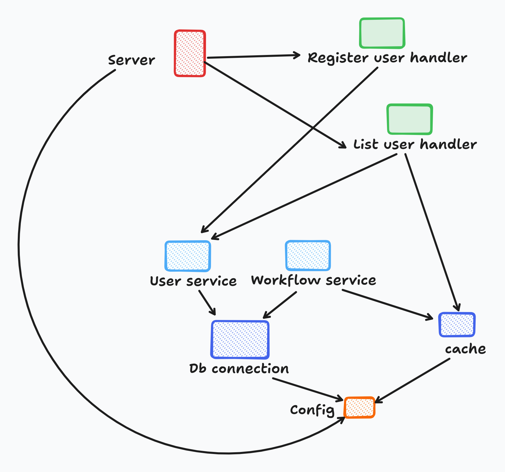

# Managing dependency with Submodule



Does the demonstrated diagram look familiar to you? A lot of applications will look just like so.

Without any IoC or Dependency Injection framework / libraries, those applications will suffer from those issues
- Everything centralized in `main` method, and will be scattered to all services
- The higher level of the component you want to test, it'll be more complicated to setup tests

Tak `Register user handler` as an example, to setup the test for it
- You'll need to mock `User service`
- Or you'll need to mock `Db connection`
- Or you'll need to mock `Config`

`Submodule` was born to balance the Ioc wiring, so you don't have to pull your hairs just to test your app

# How does Submodule work?

Submodule is built around the concept of function composition. A component will be hidden/lazy initialized behind a function.
And if another module requires that component, submodule will associate those factory functions. The initialization will only happen when one of those components got used

So, Submodule will just replicate exactly what described as dependencies in the diagram, and only initialized when one of those components got called

Then, with the knowledge of dependencies like so, Submodule will initialize just what it is needed to support testing

# Enough talk, show me the code

```go
package main

import (
	"fmt"
	"net/http"

	"github.com/submodule-org/submodule.go"
)

type Config struct {
	Host     string
	Port     int
	LogLevel string
}

func LoadConfig() Config {
	// load config from ENV etc
	return Config{
		Host:     "",      // value from env or default value
		Port:     0,       // value from env or default value
		LogLevel: "debug", // value from env or default value
	}
}

// ConfigMod will be the singleton container for config value
var ConfigMod = submodule.Provide(LoadConfig)

type logger struct {
	LogLevel string
}

type Logger interface {
	Log(msg ...string)
}

func (l *logger) Log(msgs ...string) {
	// log implementation with log level
}

var LoggerMod = submodule.Make[Logger](func(config Config) Logger {
	return &logger{
		LogLevel: config.LogLevel,
	}
}, ConfigMod)

type server struct {
	Config Config
	Logger Logger
}

func (s *server) Start() {
	go func() {
		http.ListenAndServe(fmt.Sprintf("%s:%d", s.Config.Host, s.Config.Port), nil)
	}()
}

var ServerMod = submodule.Craft(&server{}, ConfigMod, LoggerMod)

func main() {
	server := ServerMod.Resolve()
	server.Start()
}

```